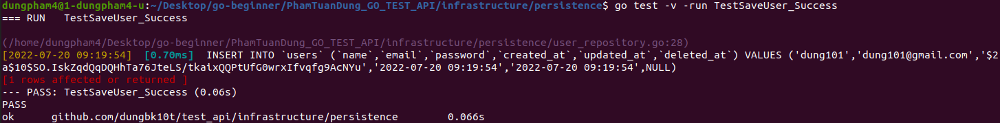
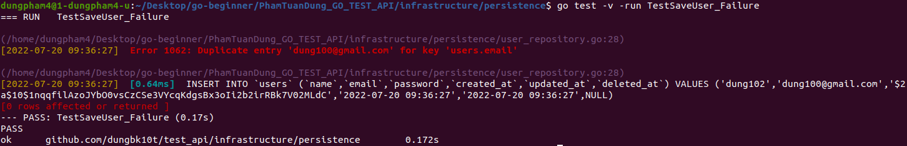
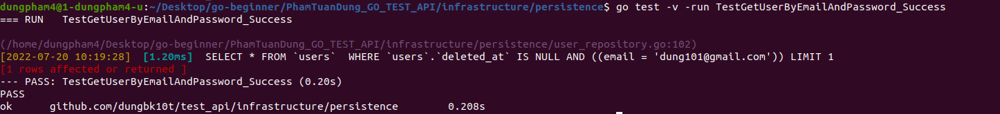
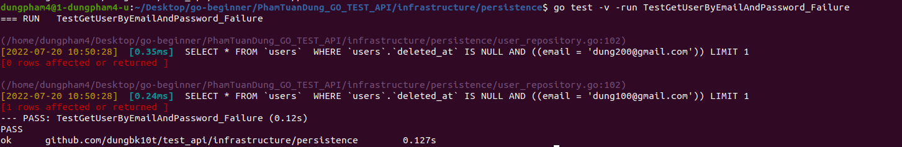
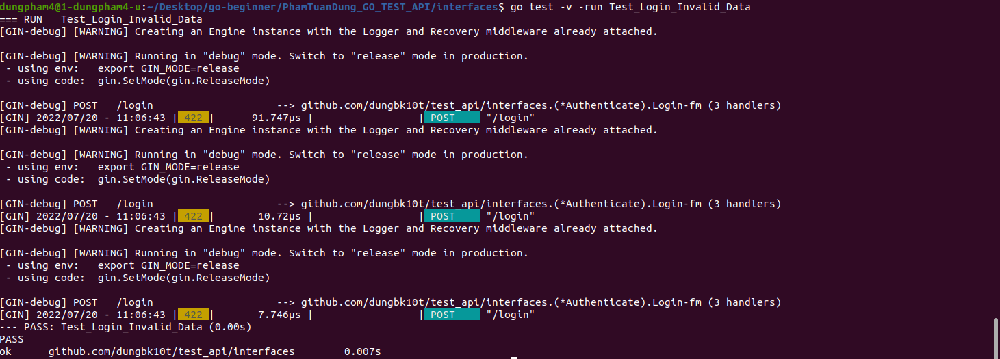
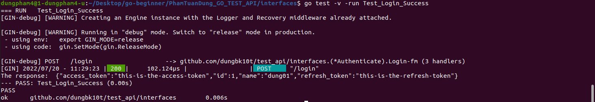
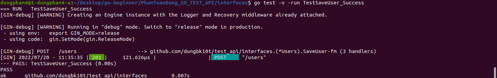
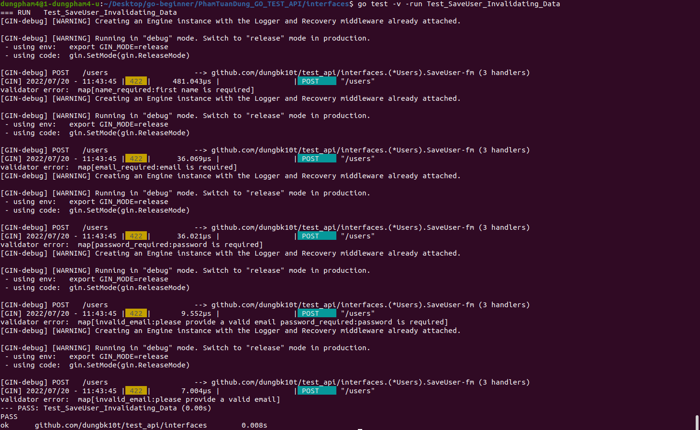

### UNIT TEST EXAMPLE
#### I. persistence/user_repository_test.go  

#### 1.TestSaveUser_Success
 
#### 2.TestSaveUser_Failure
 
#### 3.TestGetUser_Success
 
#### 4.TestGetUser_Failure
 
#### 5.TestGetUsers_Success
 
#### 6.TestGetUserByEmailAndPassword_Success
 
#### 7.TestGetUserByEmailAndPassword_Failure
 
#### 8.TestDeleteUser_Success
 

#### II. interfaces.login_handler_test.go  
#### 1.TestSaveUser_Success
 
#### 2.Test_Login_Success
 

#### III. interfaces.login_handler_test.go  
#### 1.TestSaveUser_Success
 
#### 2.Test_SaveUser_Invalidating_Data
 
#### 3.TestSaveUser_DB_Error
 
#### 4.TestGetUsers_Success
 
#### 5.TestGetUser_Success
 

